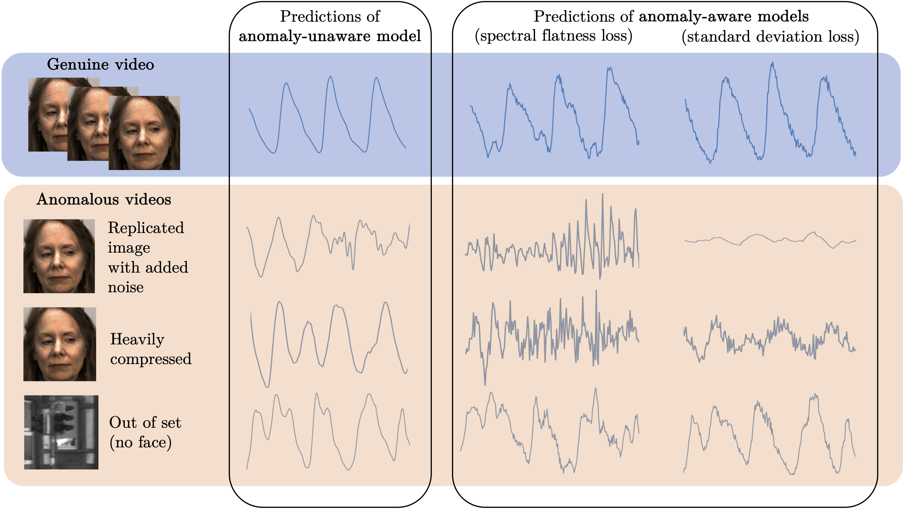

# Anomaly-Aware-rPPG
(Official repo for BIOSIGNALS 2023 paper)

Official BIOSIGNALS 2023 Paper: [Anomaly-Aware Remote Photoplethysmography](https://www.scitepress.org/Papers/2023/117817/117817.pdf)

Link to arXiv Paper: [Anomaly-Aware Remote Photoplethysmography](https://arxiv.org/abs/2303.06452)

## Preprocessing
First check the preprocessing code in `src/preprocessing` to prepare all of the video datasets you have available.

A list of the datasets used in the paper are:
- DDPM ([link](https://cvrl.nd.edu/media/django-summernote/2021-09-09/ef06f4a4-53f4-4b90-af1a-b8b023983762.pdf))
- PURE ([link](https://www.tu-ilmenau.de/en/university/departments/department-of-computer-science-and-automation/profile/institutes-and-groups/institute-of-computer-and-systems-engineering/group-for-neuroinformatics-and-cognitive-robotics/data-sets-code/pulse-rate-detection-dataset-pure))
- UBFC-rPPG ([link](https://sites.google.com/view/ybenezeth/ubfcrppg))
- HKBU_MARs-V2 ([link](https://rds.comp.hkbu.edu.hk/mars/))
- DFDC ([link](https://ai.meta.com/datasets/dfdc/))
- KITTI ([link](https://www.cvlibs.net/datasets/kitti/))

## Training
Models can be trained by using the script, which has preset parameters which can be adjusted for the experiment:
```
cd scripts
sh train.sh  # for normal training
sh train_negative.sh  # for training with negative samples
```

## Testing after Model Training
To make predictions on the testing datasets with your different models, you can use the `validate_emitter.py` script:
```
cd src
python validate_emitter.py
```

## Feature Extraction and SVM fitting to Predict Anomalies
All of the feature extraction and SVM fitting code is in the `testing` folder.
See the order of processing in the `testing/README.md` file.
In general, you can run the python scripts by running the bash scripts in the `testing/scripts` folder.
For example:
```
cd testing/scripts
## Edit the predict.sh file to specify the model and dataset you want to use
sh predict.sh
```



